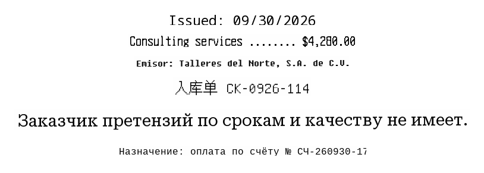

## An augmentation pipeline for cropped text images

**Printing** — uneven toner, irregular letter edges, and paper grain simulate printed text.  
**Marks** — random patches of ink marks are overlaid on the text line.  
**Erasure** — a wear mask fades parts of the letters.  
**Paper defects** — textures add stains, scuffs, and other background defects.  
**Geometry** — bends the text line and compresses its edge, as on a warped sheet.  
**Scan** — blur, directional motion blur at a random angle, and contrast changes simulate scanning or photographing.  
**Low resolution** — downscaling and upscaling the crop remove fine details.  
**Noise** — added after resampling when the scan effect is active; simulates image noise.  
**JPEG** — re-encoding adds compression artifacts.

---

This pipeline was used alongside standard on-the-fly augmentations to train the [Russian PP-OCRv6 models](https://huggingface.co/collections/vladlinv/ru-ocr) and to generate synthetic examples for the [RU OCR Rec Benchmark](https://huggingface.co/datasets/vladlinv/ru-ocr-benchmark-hard).

